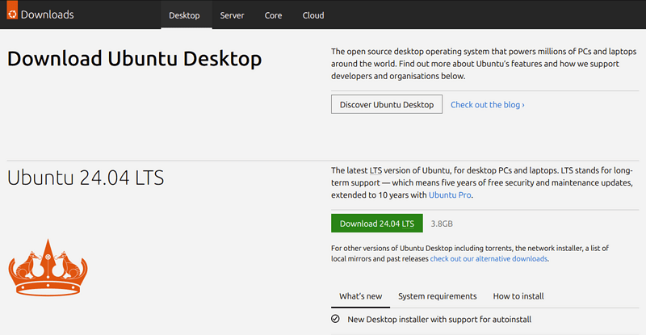

2. Download an Ubuntu Image

You can download an Ubuntu image here. Make sure to save it to a memorable location on your PC! For this tutorial, we will use the latest Ubuntu 24.04 LTS release (available on April 25th 2024) which uses the new Ubuntu Desktop installer that will be included in all future Ubuntu releases.

If you are installing an older version of Ubuntu, such as Ubuntu 22.04 LTS, you will find that the visual presentation of the installer is different, but the overall flow should remain similar.

image
